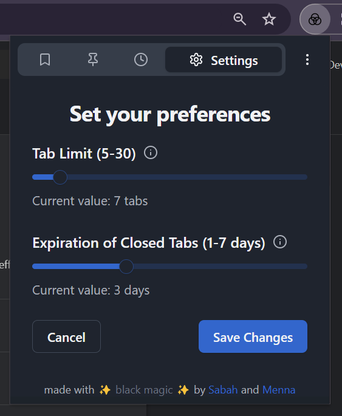
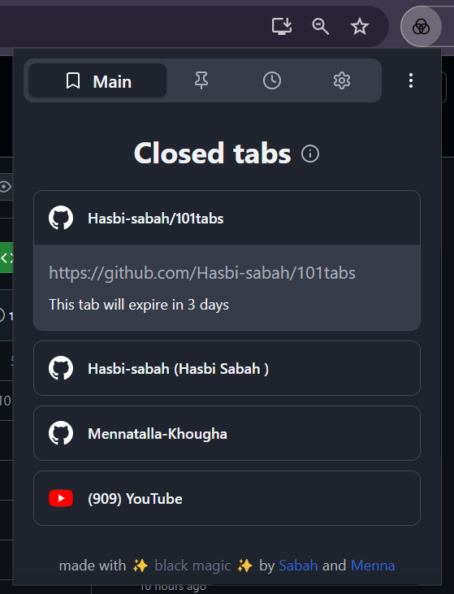
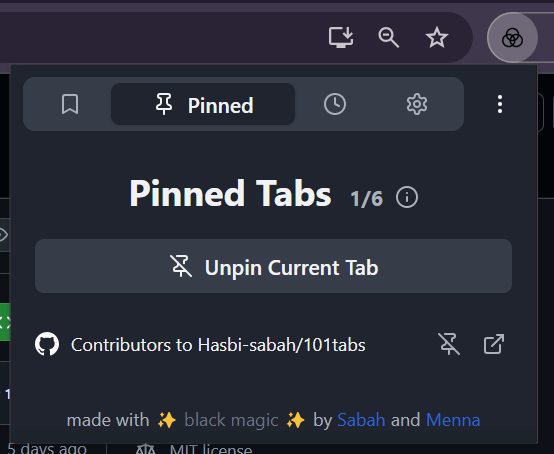
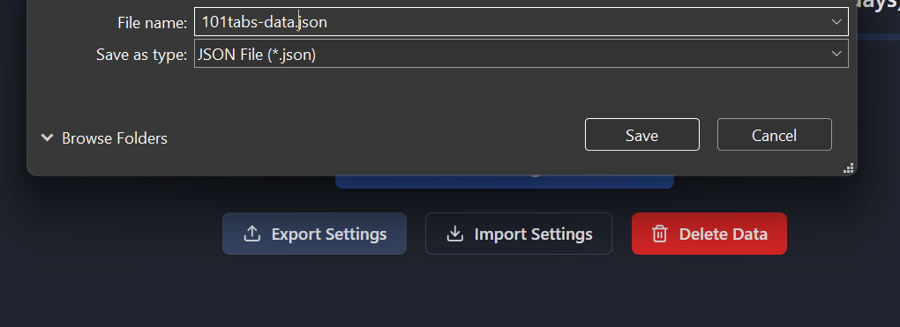

# 101tabs - Efficient Tab Management for Chrome Users

## Description

101tabs is designed to tackle the common problem of managing too many open tabs in your browser. It provides a streamlined and organized experience for users who frequently juggle multiple tabs. Key features include:

- **Customizable:** You can set a maximum number of tabs to have open at any time per window as well as the expiration time for the automatically closed tabs, tailoring the experience to your browsing habits.

- **Auto Tab Closure:** Automatically closes the least visited tabs when your predefined tab limit is reached, keeping your browser clean and responsive.

- **Pinned Tabs Protection**: Pinned tabs remain safe and won't be closed automatically, ensuring that your most important tabs stay open.

- **Data Export/Import:** Backup and restore your tab settings and data with ease, ensuring your preferences are saved across sessions or devices.

With 101tabs, you can keep your browsing experience clean and efficient, ensuring that you only keep the tabs you need.

## Installation (From GitHub)

Follow these steps to install the 101tabs extension from GitHub:

1. **Download the Release ZIP File**
   - Go to the [101tabs GitHub Releases page](https://github.com/Hasbi-sabah/101tabs/releases).
   - Download the latest release ZIP file.

2. **Extract the Downloaded ZIP File**
   - Extract the downloaded ZIP file to a folder on your computer.

3. **Open Chrome and Navigate to chrome://extensions**
   - Open your Chrome browser and go to `chrome://extensions`.

4. **Enable "Developer mode"**
   - In the top-right corner, enable "Developer mode" by toggling the switch.

5. **Click "Load unpacked"**
   - Click the "Load unpacked" button and select the folder where the extension is located.

